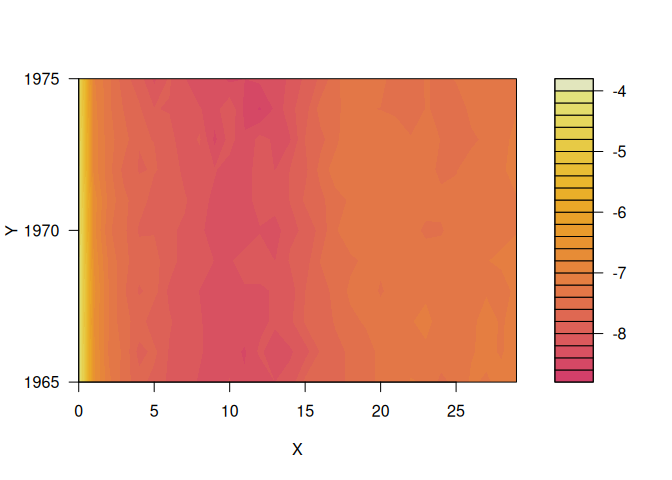
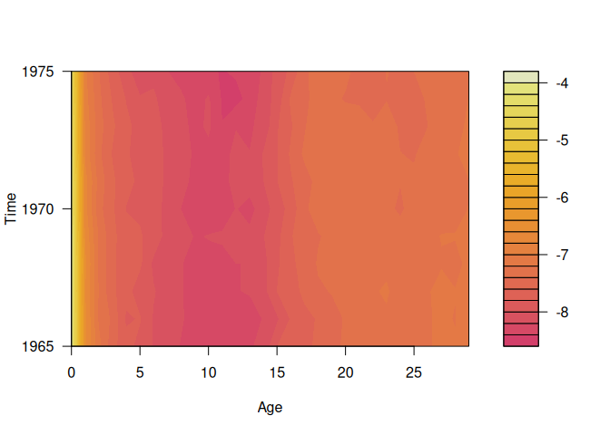
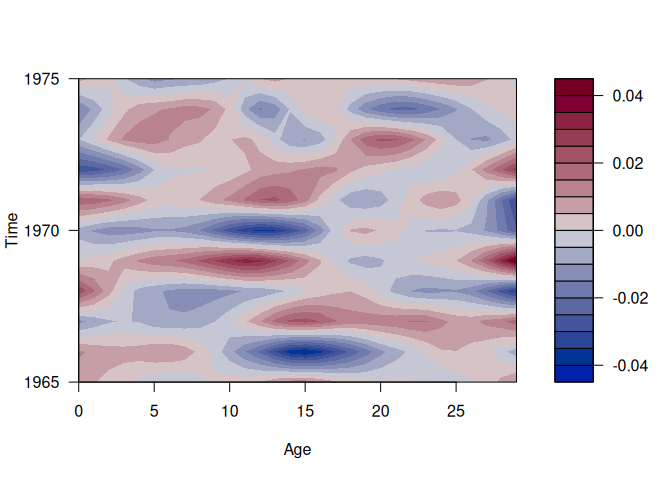
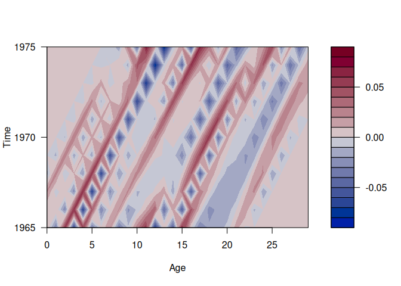

<!-- README.md is generated from README.Rmd. Please edit that file -->

# smoothAPC

<!-- badges: start -->
<!-- badges: end -->

The goal of smoothAPC is to model mortality rates as the sum of four
components: a smooth bivariate function of age and time, smooth
one-dimensional cohort effects, smooth one-dimensional period effects,
and random errors. The model uses bivariate thin plate splines,
bivariate lasso-type regularization, and allows for both period and
cohort effects.

## Installation

You can install the **stable** version from
[CRAN](https://cran.r-project.org/package=smoothAPC):

``` r
pak::pak("smoothAPC")
```

You can install the development version of smoothAPC from
[GitHub](https://github.com/) with:

``` r
# install.packages("pak")
pak::pak("robjhyndman/smoothAPC")
```

## Example

``` r
library(smoothAPC)
m <- log(demography::fr.mort$rate$female[1:30, 150:160])
#> Registered S3 method overwritten by 'quantmod':
#>   method            from
#>   as.zoo.data.frame zoo
#> Registered S3 methods overwritten by 'demography':
#>   method      from 
#>   print.lca   e1071
#>   summary.lca e1071
plot(m)
```



``` r
sm <- autoSmoothAPC(m)
plot(sm)
```



``` r
plot(sm, "period")
```



``` r
plot(sm, "cohort")
```


